```{r setup, include=FALSE}
knitr::opts_chunk$set(echo = TRUE)
```

<font size = 5>
(1)	Create a view to get airlines with most no of flights?
`CREATE VIEW most_flights_airlines AS Select a.airline_name,f.airline_id,Count(*) from flights as f left join airline as a on a.airline_id = f.airline_id group by airline_id
ORDER BY COUNT(*) DESC
limit 0,5;`

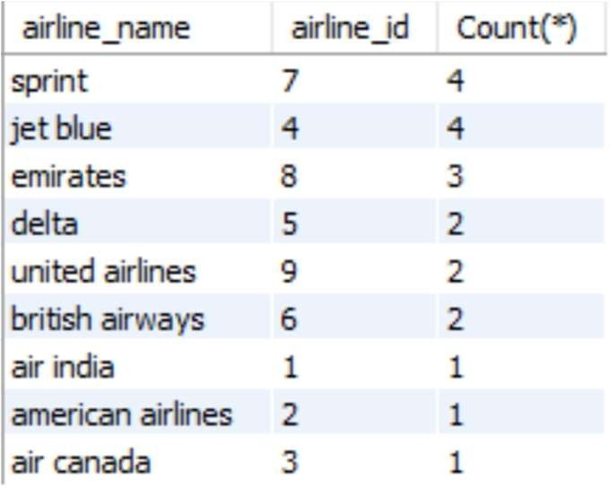{width=200}

</font>

<font size = 5>
(2)	Create view to fetch airlines with most no of passengers
`CREATE OR REPLACE VIEW `most_passengers_airline` AS
Select a.airline_name,Sum(f.number_of_passengers) as 'Total Passsengers served' from flights as f
left join airline as a on a.airline_id = f.airline_id group by f.airline_id
ORDER BY Sum(number_of_passengers) DESC;
`

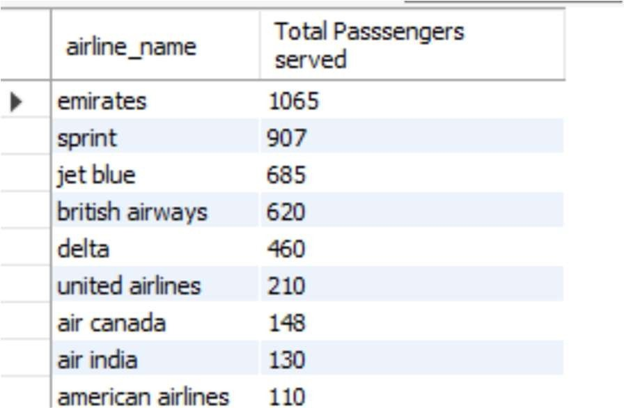{width=200}

</font>

<font size = 5>
(3)	Get top 5 passsenger based on No of tickets
`CREATE VIEW `top_5_passengers_tickets` AS
Select p.first_name as 'First Name',Count(*) as 'Number of Tickets' from ticket as t left join passenger as p on p.passenger_id = t.passenger_id
group by t.passenger_id Order by Count(*) desc limit 0,5;`

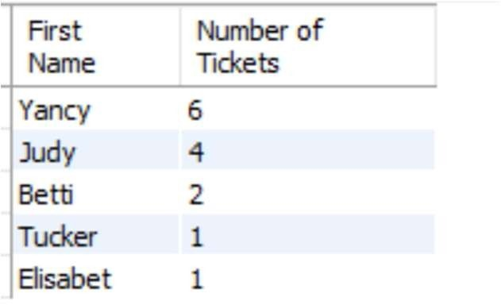{width=200}

</font>


<font size = 5>
(4)	Create view to get top 5 passengers based on amount spent (ticket Price)
`CREATE VIEW `top_5_passengers_amount_spent` AS
Select p.first_name as 'First Name',SUM(t.ticket_price) as 'Total spent' from ticket as t left join passenger as p on p.passenger_id = t.passenger_id
group by t.passenger_id
Order by SUM(t.ticket_price) desc limit 0,5;`

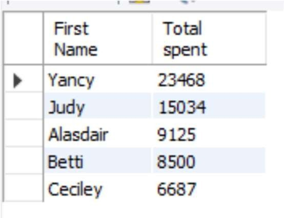{width=200}

</font>

<font size = 5>
(5)	Get list of retail shops based on Revenue(Descending order)
`select retail_store_id, leasing company, rent from retail_duty_stores order by rent desc;`

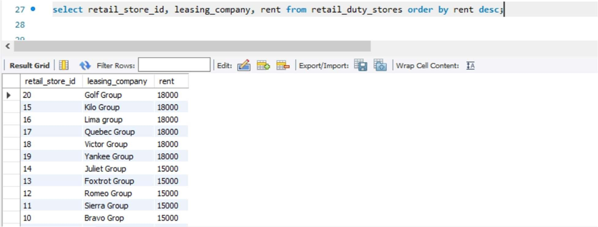{width=500}

</font>

<font size = 5>
(6)	Get list of Airport lounges

`select lounge_id, managed_by from airport lounge;
`

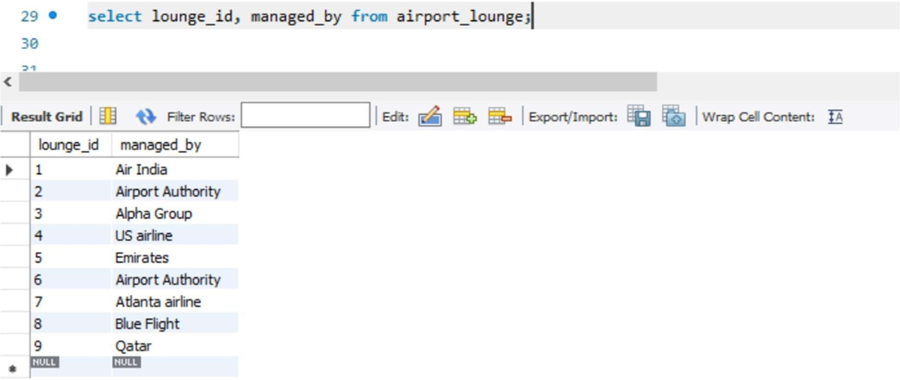{width=500}

</font>

<font size = 5>
(7) Get airlines based on terminals Assigned
`select sum(rent), a.terminal_id, t.terminal_name
from airport_lounge as a
left join terminals as t
on a.terminal_id = t.terminal_id
group by terminal_id
order by sum(rent) desc;
`

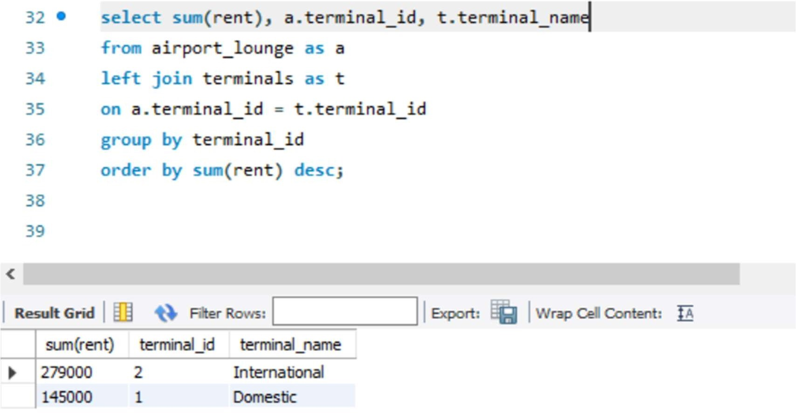{width=500}

</font>

<font size = 5>
(8)	Get airlines based on check-in counter type(Full Time)


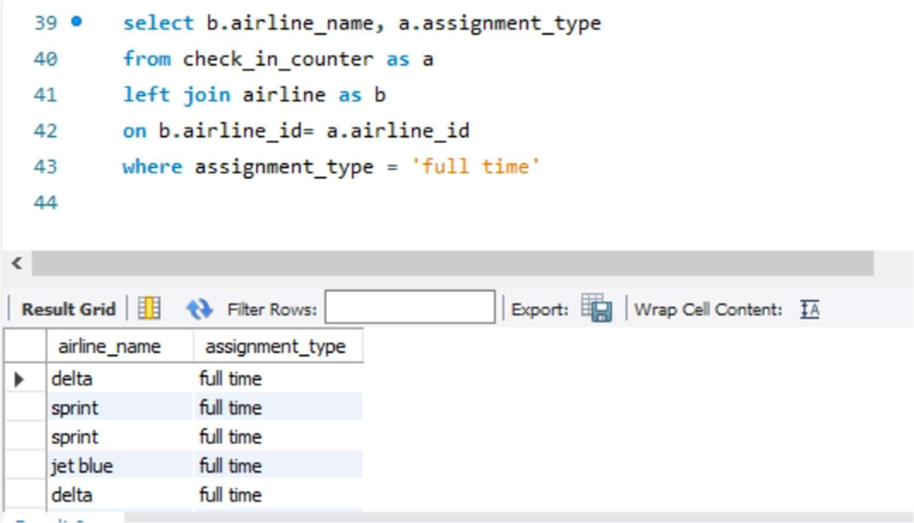{width=500}

</font>

<font size = 5>
(9)	Get airlines based on check-in counter type(Part Time)


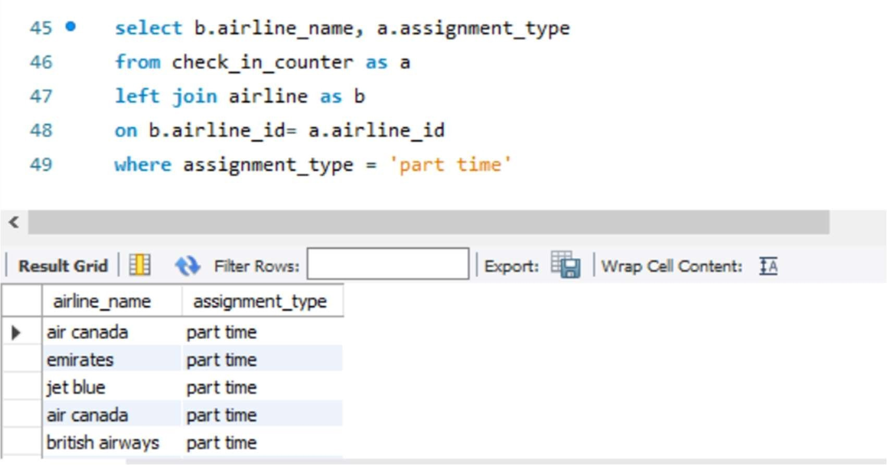{width=500}

</font>

<font size = 5>
(9)	Get airlines in descending order of the amount spent on Hangar Rent


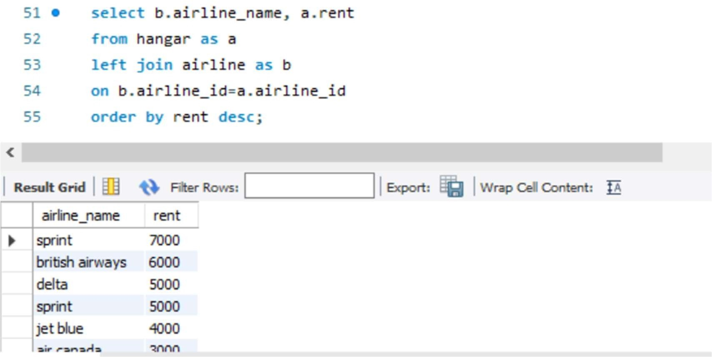{width=500}

</font>

<font size = 5>
(10) Get airlines in descending order of time spent in Hangar


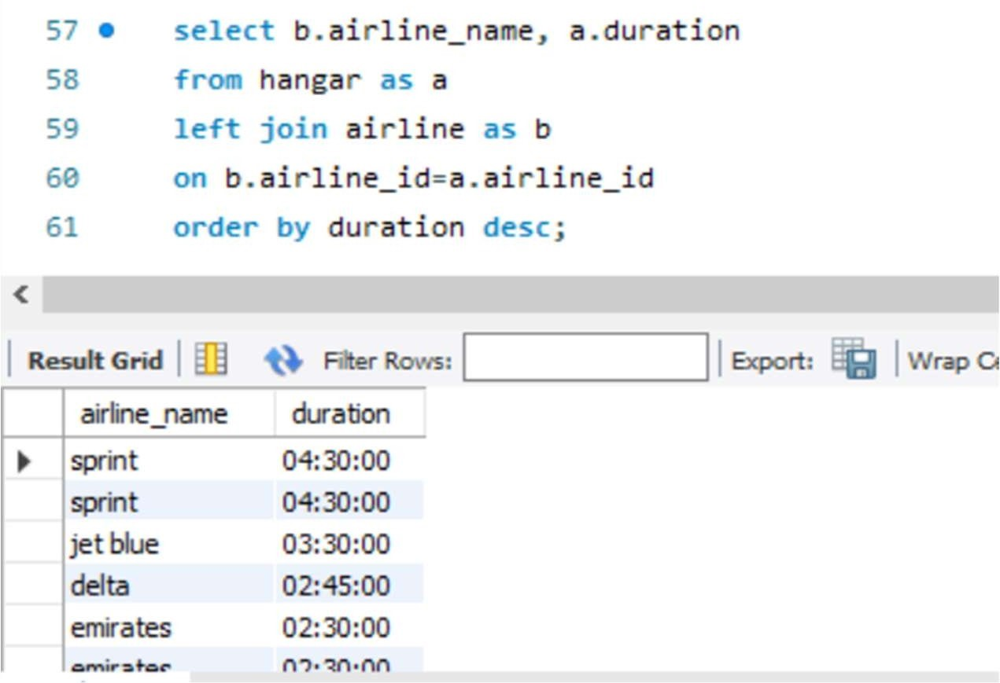{width=500}

</font>

<font size = 5>
(11)	Display Hierarchy of Employees.


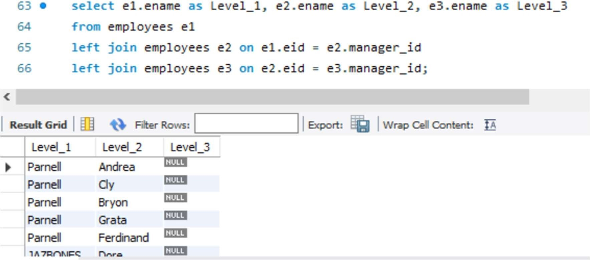{width=500}

</font>

<font size = 5>
(12) Display highest salary of the employees reporting to the same manager as the employee (Show the MAX Salary from same reporting manager group)

`Select eid,ename,job_title,hiring_date,manager_id,Max(salary) from employees where manager_id is not Null
GROUP by manager_id;
`

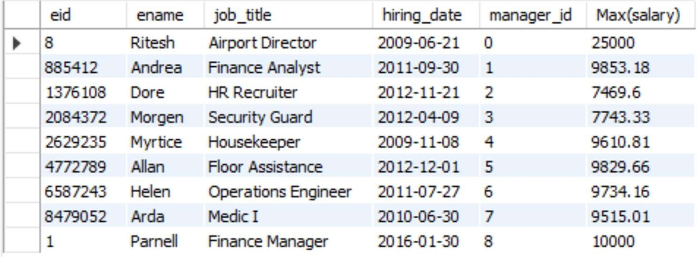{width=500}
</font>

<font size = 5>
13)	Top 5 highest paid employees
`Select * from employees Order by salary DESC limit 5;
`

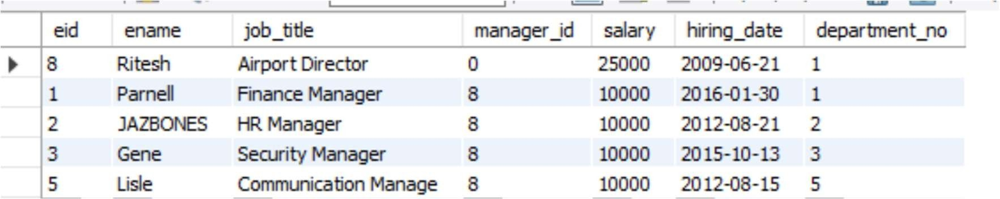{width=500}
</font>

<font size = 5>
(14) Display employee ID, hire date, number of months employed from EMP table.
`SELECT ename,hiring_date,TIMESTAMPDIFF(MONTH,hiring_date,CURDATE()) as 'Month' FROM employees;
`

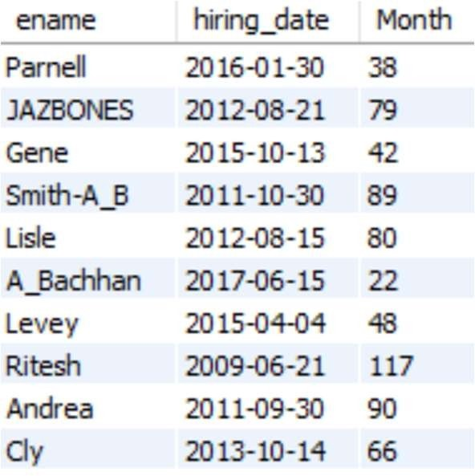{width=200}
</font>

<font size = 5>
(15) Get all users
`Select * from mysql.user
`

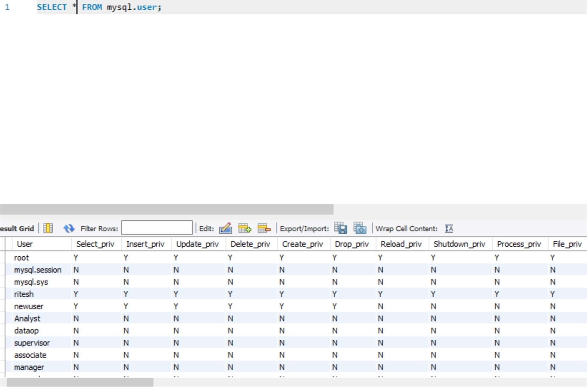{width=500}
</font>

<font size = 7>

Triggers

</font>

<font size = 5>
(1) Salary cannot be 0

```
`CREATE TRIGGER no_zero_sal BEFORE INSERT ON employees FOR EACH ROW BEGIN IF (NEW.salary = 0) THEN signal sqlstate '45000' set message_text = 'Salary Cannot be 0'; END IF; END`
```
{width=900}

</font>

<font size = 5>
(2) Ticket Price cannot be 0
`Drop trigger if exists logan_airport.ticket_before_insert;`

`DELIMITER $$
CREATE DEFINER = CURRENT_USER TRIGGER logan_airport,ticket_BEFORE_INSERT
BEFORE INSERT ON ticket FOR EACH ROW
BEGIN
IF (NEW.ticket_price = 0) THEN
signal sqlstate 45000 set message_text = Ticket Price Cannot be 0;
END IF;
END$$
DELIMITER ; `

</font>

<font size = 5>
(3)	Hangar Rent cannot be 0

`DROP TRIGGER IF EXISTS logan_airport , no_zero_rent;`

`DELIMITER $$
CREATE DEFINER = CURRENT_USER TRIGGER no_zero_rent BEFORE INSERT ON `hangar` FOR EACH ROW
BEGIN
IF (NEW.rent = 0) THEN
signal sqlstate '45000' set message_text = 'Rent Cannot be 0'; END IF;
END$$
DELIMITER; `

</font>

<font size = 5>
(4) Hangar rent cannot be 0

`DROP TRIGGER IF EXISTS logan_airport , no_zero_rent;`

`DELIMITER $$
CREATE DEFINER = CURRENT_USER TRIGGER no_zero_rent BEFORE INSERT ON `hangar` FOR EACH ROW
BEGIN
IF (NEW.rent = 0) THEN
signal sqlstate '45000' set message_text = 'Rent Cannot be 0'; END IF;
END$$ DELIMITER ;`


</font>

<font size = 5>
(4) Retail store rent cannot be 0

`CREATE DEFINER = CURRENT_USER TRIGGER no_zero_rent BEFORE INSERT ON
`retail_duty_stores` FOR EACH ROW BEGIN
IF (NEW.rent = 0) THEN
signal sqlstate '45000' set message_text = 'Rent Cannot be 0'; END IF;
END; `

</font>

<font size = 5>
(5) Airport lounge rent cannot be 0

`CREATE DEFINER = CURRENT_USER TRIGGER NO_ZERO_RENT BEFORE INSERT ON
`airport_lounge` FOR EACH ROW BEGIN
IF (NEW.rent = 0) THEN
signal sqlstate '45000' set message_text = 'Rent Cannot be 0'; END IF;
END;`

</font>

