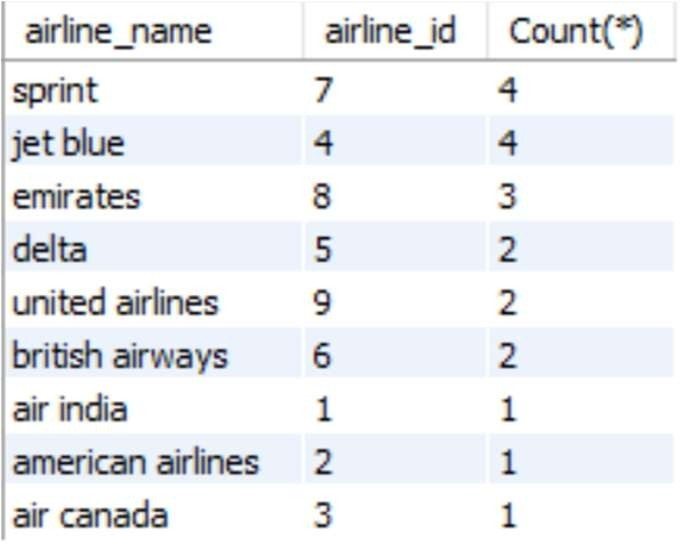

```{r setup, include=FALSE}
knitr::opts_chunk$set(echo = TRUE)
```

<font size = 5>
(1)	Create a view to get airlines with most no of flights?
`CREATE VIEW most_flights_airlines AS Select a.airline_name,f.airline_id,Count(*) from flights as f left join airline as a on a.airline_id = f.airline_id group by airline_id
ORDER BY COUNT(*) DESC
limit 0,5;`



</font>

